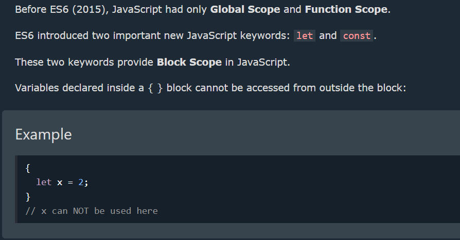

### Оглавление
- Scope
- Hoisting
- Recursion
- Closure

#### Scope(область видимости)
###### В JavaScript, область видимости (scope) определяет, где и как переменные (и функции) могут быть доступны в вашем коде. Она определяет контекст, в котором переменная может быть использована, и какие части кода имеют доступ к этой переменной.
###### В JavaScript есть два основных типа области видимости:
-  Глобальная область видимости (Global Scope)
###### var globalVariable = 10;
###### function myFunction() {
######   console.log(globalVariable); // Можно получить доступ к глобальной переменной
###### }
###### console.log(globalVariable); // 10

- Локальная область видимости (Local Scope)
###### function myFunction() {
######   var localVariable = 20; // Локальная переменная
######   console.log(localVariable); // 20
###### }
###### console.log(localVariable); // Ошибка: localVariable не определена

#### Hoisting (поднятие)
###### Hoisting (поднятие) в JavaScript - это механизм, при котором объявления переменных и функций перемещаются вверх внутри их области видимости перед выполнением кода. Это позволяет вам использовать переменные или вызывать функции до их фактического объявления в коде.
###### console.log(x); // undefined
###### var x = 5;
###### console.log(x); // 5

###### myFunction(); // "Hello!"
###### function myFunction() {
######   console.log("Hello!");
###### }

###### Важно отметить, что поднятие (hoisting) работает только для объявлений переменных с использованием var и объявлений функций (Function Declarations), но не для переменных, объявленных с использованием let или const, и не для функций, объявленных с использованием функциональных выражений (Function Expressions) или стрелочных функций (Arrow Functions).
###### 

#### Recursion (Рекурсия)
###### Рекурсия (recursion) в JavaScript - это процесс, при котором функция вызывает саму себя в своем теле. В рекурсивной функции происходит повторение операций с уменьшением или изменением аргументов каждый раз при вызове, пока не будет достигнуто условие выхода из рекурсии.
###### Пример
###### function countdown(n) {
######   if (n <= 0) {
######     console.log("Done!");
######   } else {
######     console.log(n);
######     countdown(n - 1);
######   }
###### }
###### countdown(5);

###### Рекурсия также может использоваться для решения более сложных задач, таких как обход деревьев или решение задач динамического программирования. Однако важно быть внимательным при использовании рекурсии, чтобы избежать бесконечной рекурсии или неэффективного использования ресурсов.
###### 

### closure (Замыкание)
Замыкание — это функция JavaScript, которая позволяет внутренним функциям получать доступ к внешней области действия функции. Закрытие помогает привязать функцию к ее внешней границе и создается автоматически всякий раз, когда создается функция. Блок также рассматривается как область видимости, начиная с ES6. Поскольку JavaScript управляется событиями, замыкания полезны, поскольку помогают поддерживать состояние между событиями.

