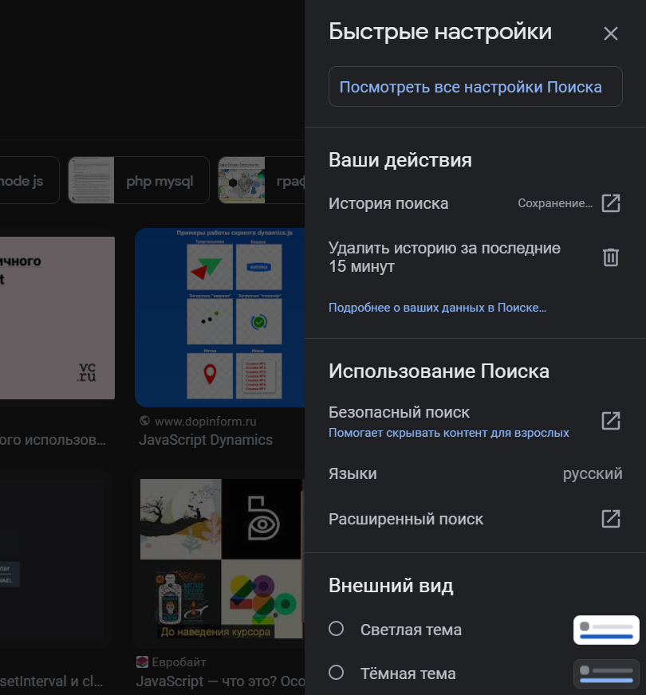
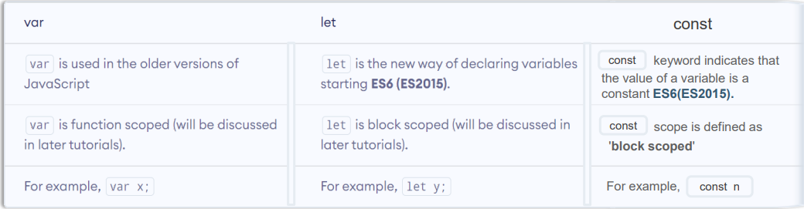
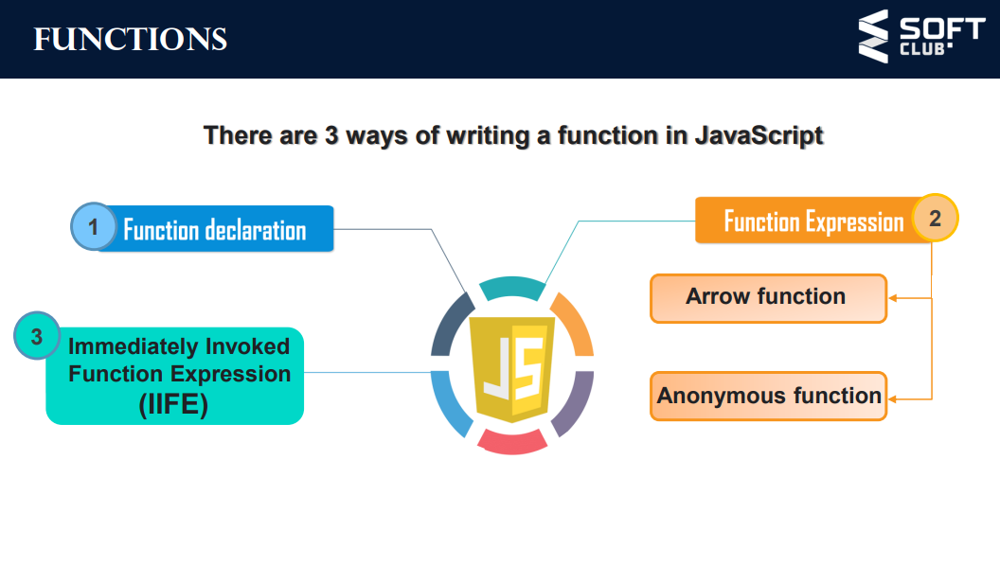
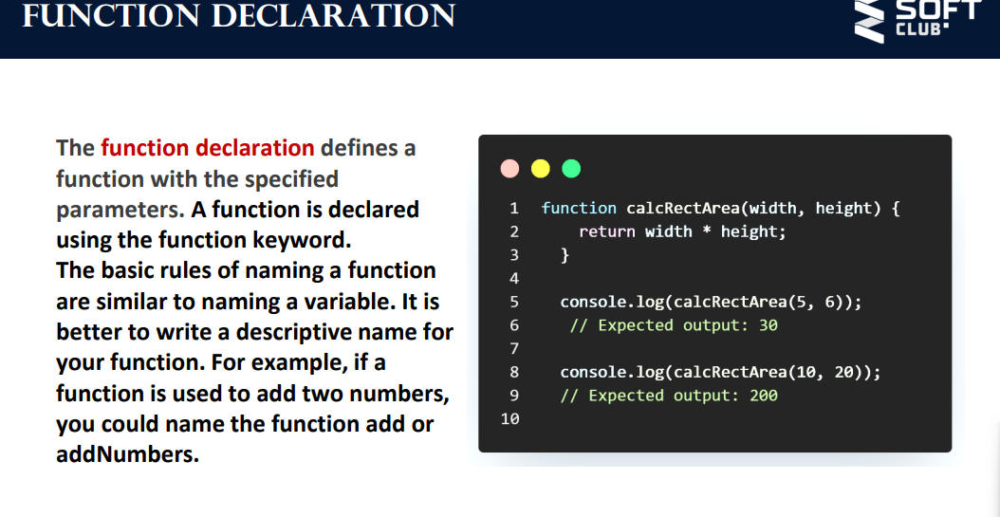
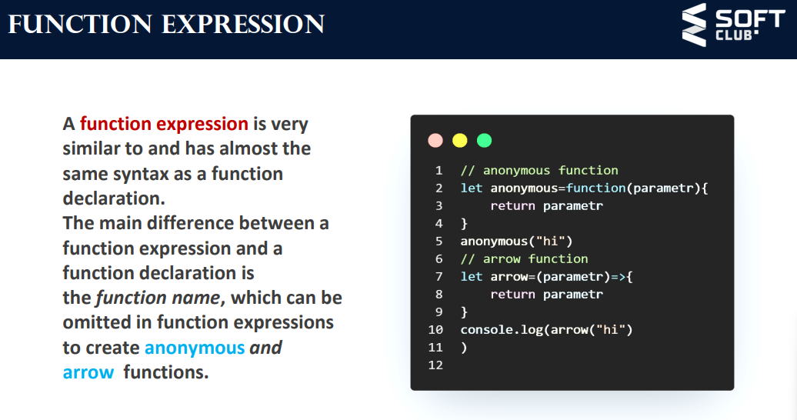
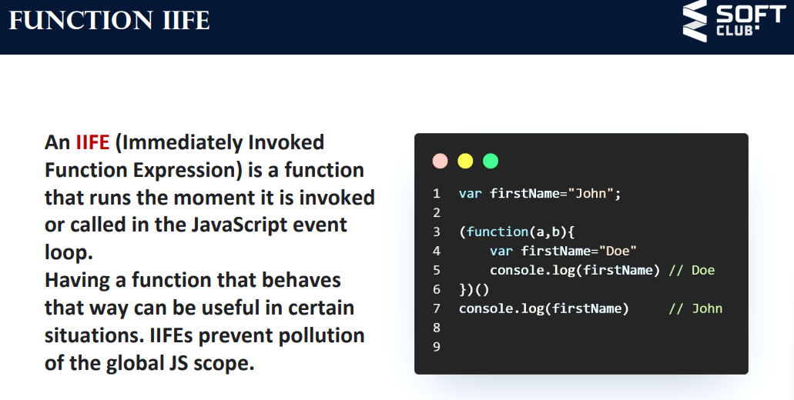

# Что это значит JS?
JavaScript – это язык программирования, который используют разработчики для создания интерактивных веб-страниц. Функции JavaScript могут улучшить удобство взаимодействия пользователя с веб-сайтом: от обновления ленты новостей в социальных сетях и до отображения анимации и интерактивных карт.

### Для чего создан JS?
JavaScript (JS) это язык программирования, который в основном используется для создания динамических скриптов на веб-страницах, но он так же часто применяется на стороне сервера, используя пакеты, такие как Node. JS.

## Какие веб страницы называют интерактивными?
Интерактивные страницы – это В. -с., включающие в себя создаваемые на скриптовых языках (PHP, JavaScript и др.) формы, с помощью которых происходит обмен данными между страницей и пользователем.

## Какие сайты называются динамическими?
Динамический сайт — сайт, состоящий из динамичных страниц — шаблонов, контента, скриптов и прочего, в большинстве случаев хранящихся на сервере как отдельные ресурсы (файлы, данные в базах данных и на сторонних серверах).

### 1. Интерпретируемый, а не компилируемый. 
Все языки программирования делятся на две группы. Код на компилируемых языках нужно сначала пропустить через специальную программу, компилятор, и только потом его можно использовать. Большинство современных языков как раз компилируемые в отличие от JavaScript.

Код на интерпретируемом языке компилировать не нужно. Его пишут и сразу передают программе-интерпретатору, которая тут же его выполняет. Это ускоряет разработку, но требует запуска только в связке с интерпретатором. Правда, интерпретатор JavaScript встроен во все современные браузеры, так что проблем с запуском кода нет.

### Без строгой типизации.
У языка JavaScript типизация динамическая — в переменную можно положить что угодно. Это облегчает написание кода, но может вызвать ошибки. Например, JavaScript позволит сравнить строку с числом и даже выдаст какой-то результат. Что больше, «корова» или «81»? JavaScript знает ответ.

## Переменные и константы JavaScript
 #### 1. **var (устарел)**:
  Ранее использовался для объявления переменных, но имеет некоторые проблемы с областью видимости. Рекомендуется избегать использования `var` в современном коде.

#### 2. **let**:
 Введен в ECMAScript 6 (ES6) и используется для объявления переменных с блочной областью видимости. Переменные, объявленные с помощью `let`, могут быть изменены после объявления.

 #### 3. **const**:
  Также введен в ES6. Объявляет переменную с блочной областью видимости, но значение этой переменной не может быть изменено после присвоения. Однако объекты и массивы, объявленные с `const`, могут изменяться, но их ссылки не могут быть изменены.

  

  ## ОБЪЕКТЫ И ПРИМИТИВЫ

  В JavaScript есть две основные категории типов данных: примитивы и объекты. Понимание разницы между этими двумя категориями имеет решающее значение для написания эффективного и действенного кода.

Примитивы: 
Примитивы — это самые основные типы данных в JavaScript. Они неизменяемы, то есть их значения не могут быть изменены после их создания. В JavaScript существует пять примитивных типов данных:

- Строка : представляет последовательность символов, заключенную в одинарные ('') или двойные ("") кавычки. 

let name = "John";    // String
- Number : Представляет как целые числа, так и числа с плавающей запятой.

let age = 30;         // Number
- Boolean : представляет логическое значение, либо , trueлибо false.

let isStudent = false;// Boolean
- Undefined : представляет переменную, которая была объявлена, но ей не присвоено значение.

let job;              // Undefined
- Null : представляет преднамеренное отсутствие какого-либо значения или ссылки на объект.

let noValue = null;   // Null

### Правила именования переменных JavaScript

Имена переменных :

Имена переменных должны начинаться с буквы (az, AZ) или символа подчеркивания (_).
Они также могут включать цифры (0-9), но не в качестве первого символа.
Имена переменных чувствительны к регистру, что означает, что myVariableони myvariableявляются разными идентификаторами.
Зарезервированные слова :

Избегайте использования зарезервированных слов JavaScript в качестве имен переменных. Зарезервированные слова — это ключевые слова, которые имеют особое значение в языке, например if, while, for, function, и т. д.
Значимые имена :

Выберите описательные и осмысленные имена для ваших переменных. Это помогает сделать ваш код более читабельным и понятным.
Используйте camelCase для имен переменных, состоящих из нескольких слов. Начните первое слово со строчной буквы и сделайте заглавной первую букву каждого последующего слова. Например: myVariableName, numberOfItems, userInput.
Константы :

Если значение переменной не должно меняться, рассмотрите возможность использования всех прописных букв с подчеркиванием, чтобы указать, что это константа. Например: MAX_VALUE, PI.
Подчеркивания и дефисы :

Хотя имена переменных могут включать символы подчеркивания, избегайте использования дефисов, поскольку они недопустимы в именах переменных. Вместо этого используйте символы подчеркивания для разделения слов.
Цифры в именах :

Вы можете включать числа в имена переменных, но они не могут быть первым символом. Например, count1действует, но 1countне является.
Масштаб и контекст :

Переменные, объявленные с помощью var, let, или const имеют

### Операторы В JavaScript
JavaScript предоставляет множество операторов, которые позволяют выполнять различные типы операций со значениями, переменными и выражениями. Эти операторы можно разделить на несколько групп:

Арифметические операторы :

- +: Добавление
- -: вычитание
- *: Умножение
- /: Разделение
- %: Модуль (остаток от деления)
- **: Возведение в степень (ES6)

Операторы присваивания :

- =: Назначение
- +=: Дополнительное назначение
- -=: Назначение вычитания
- *=: Назначение умножения
- /=: Назначение отдела
- %=: Назначение модуля
- **=: Возведение в степень (ES6)

Операторы сравнения :

- ==: Равно
- ===: Строго равно
- !=: Не равно
- !==: Строго не равно
- >: Больше чем
- <: Меньше, чем
- >=: Больше или равно
- <=: Меньше или равно

Логические операторы :

- &&: логическое И
- ||: Логическое ИЛИ
- !: Логическое НЕ

Унарные операторы :

- +: Унарный плюс (преобразует свой операнд в число)
- -: Унарный минус (инвертирует его операнд)
- ++: Увеличение
- --: Уменьшение
- typeof: возвращает строку, указывающую тип данных операнда.
- delete: удаляет свойство из объекта

## условние операторы в js

Оператор if : основной ifоператор
if (condition) { \
    // Code to execute if condition is true \
}

Оператор if...else : if...elseоператор позволяет выполнить один блок кода, если условие истинно, и другой блок, если условие ложно.

if (condition) {\
  // Code to execute if condition is true \
} else { \
  // Code to execute if condition is false \
}

Тернарный условный оператор . Тернарный оператор — это сокращенный способ записи if...elseоператора в одну строку.

condition ? expressionIfTrue : expressionIfFalse;

let age = 18; \
let isAdult = age >= 18 ? true : false;

Оператор Switch : switchоператор используется для выбора одного из многих блоков кода для выполнения. Он часто используется, когда у вас есть несколько возможных значений для переменной.

switch (expression) { \
  case value1: \
    // Code to execute if expression === value1 \
    break; \
  case value2: \
    // Code to execute if expression === value2 \
    break; \ 
  default: \
    // Code to execute if none of the cases match \
}

## цикл в js
В JavaScript циклы используются для многократного выполнения блока кода. Они необходимы

for Loop : forЦикл используется, когда вы знаете число

for (initialization; condition; increment/decrement) { \
  // Code to be executed in each iteration \
}

for (let i = 0; i < 5; i++) { \
  console.log(i); \
}

while Loop : whileповторяющийся цикл

while (condition) { \
  // Code to be executed as long as the condition is true \
}

let i = 0; \
while (i < 5) { \
  console.log(i); \
  i++; \
}

do...while Цикл : Подобно циклу while, do...whileцикл выполняет блок кода по крайней мере один раз, а затем повторно, пока условие истинно.

do { \
  // Code to be executed at least once and then as long asthe condition is true \
} while (condition); 

let i = 0; \
do { \
  console.log(i); \
  i++; \
} while (i < 5);

for...in Loop : for...inЦикл используется для перебора свойств объекта.

for (variable in object) { \
  // Code to be executed for each property of the object \
}

const person = { \
  firstName: "John", \
  lastName: "Doe", \
  age: 30 \
};

for (let key in person) { \
  console.log(key + ": " + person[key]); \
}

for...of Loop : for...ofцикл используется для перебора элементов итерируемых объектов, таких как массивы, строки, карты и наборы.

for (variable of iterable) { \
  // Code to be executed for each element of the iterable \
}

const fruits = ["apple", "banana", "orange"];

for (let fruit of fruits) { \
  console.log(fruit); \
}

