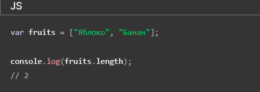
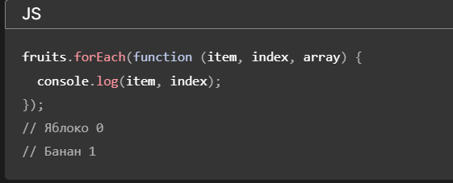

# Что такой метод в Java Script?
##### Метод — это блок кода, который запускается только при вызове.Вы можете передавать данные, известные как параметры, в метод.Методы используются для выполнения определенных действий, и они также известные как функции
 
### Стринг и его методы в JS
###### строка — это последовательность символов, заключенная в одинарные ( ') или двойные кавычки (  "). Строки являются одним из основных типов данных в JavaScript и используются для представления текста.

 let str1 = 'Hello, World!';\
 let str2 = "This is a string.";\
 let str3 = '12345';\
 let str4 = "JavaScript is awesome!";

###### JavaScript также поддерживает литералы шаблонов, заключенные в обратные кавычки (```)

 let name = 'Alice';\
 let greeting = `Hello, ${name}!`;\
 console.log(greeting); // Output: Hello, Alice!

#### Mетоды cтринг

 - charAt() 
 - concat()
 - trim()
 - includes()
 - indexOf()
 - replace() 
 - replaceAll() 
 - repeat()
 - slice()
 - substring()
 - split()
 - toString()
 - toLowerCase()
 - toUpperCase()

 

 let a = "Hey, dude!" \
 let b = a.charAt(3) \
 console.log(b)  (,) 

 let a = "Hey, dude!" \
 let res = " Whats upp"
 let b = a.concat(res) \
 console.log(b)  (Hey, dude! Whats upp) 

 let a = "   hello world!    "\
 let a1 = a.trim()\
 console.log(a1) (hello world!)

 let q = "hi"\
let q1 = q.includes("h")\
console.log(q1) (true)

let w = "wear"\
let w1 = w.indexOf('a')\
console.log(w1) (2)

let e="hi bro!"\
let e1=e.replace('hi', 'bye')\
console.log(e1) (bye bro!)

let r="hi broo!"\
let r1=r.replaceAll('o', 'bye')\
console.log(r1) (hi brbyebye)

let t="hi bro!"\
let t1=t.repeat(2)\
console.log(t1) (hi bro!hi bro!)

let y="hi bro!"\
let y1=e.slice(-4,-2)\
console.log(y1) (br)

let u="hi bro!"\
let u1=u.substring(0,2)\
console.log(u1) (hi)

let i="hi bro!"\
let i1=e.split('')\
console.log(i1) (['h','i',' ','b','r','o','!'])

let p=Math.round(Math.random()*100)\
console.log(p)

let j = 201\
let j1 = j.toString()\
console.log(j1) (201)

let k = "DEAR"\
let k1 = k.toLowerCase()\
console.log(k1) (dear)

let l = "dear"\
let l1 = l.toUpperCase()\
console.log(l1) (DEAR)

### Числовые методы JavaScript

- Math.round()
- Math.floor()
- Math.ceil()
- Math.max()
- Math.min()
- Math.pow() 
- Math.sqrt()
- Math.abs()
- isNaN()

 


let z = 1.6\
console.log(Math.round(z)) (2)

let z = 3.9\
console.log(Math.floor(z)) (3)

let z = 3.1\
console.log(Math.ceil(z)) (4)

let c = Math.max(1,2,3,4,1,3,2)\
console.log(c) (4)

let c = Math.min(1,2,3,4,1,3,2)\
console.log(c) (1)

let poww = Math.pow(4, 5)\
console.log(pow) (1024)

let sq = Math.sqrt(16)\
console.log(sq) (4)

letab = Math.abs(-256)\
console.log(ab) (256)

let o=NaN\
console.log(isNaN(o)) (true)


 ## что такое массив в js
 
 

 Массив (Array) в JavaScript является глобальным объектом, который используется для создания массивов; которые представляют собой высокоуровневые спископодобные объекты.

 Создание массива

 

Доступ к элементу массива по индексу

 

 Итерирование по массиву

 

 Добавление элемента в конец массива

 

 Удаление последнего элемента массива

 

 Удаление первого элемента массива

 

 Добавление элемента в начало массива

 

Поиск номера элемента в массиве

 

Удаление элемента с определённым индексом

 

 Удаление нескольких элементов, начиная с определённого индекса

 

 Создание копии массива

 

 Массив в JavaScript инициализируется с помощью переданных элементов, за исключением случая, когда в конструктор Array передаётся один аргумент и этот аргумент является числом (см. ниже). Стоит обратить внимание, что этот особый случай применяется только к JavaScript-массивам, создаваемым с помощью конструктора Array, а не к литеральным массивам, создаваемым с использованием скобочного синтаксиса.

 Если конструктору Array передаётся единственный аргумент, являющийся целым числом в диапазоне от 0 до 232-1 (включительно), будет возвращён новый пустой JavaScript-массив, длина которого установится в это число (примечание: это означает массив, содержащий arrayLength пустых ячеек, а не ячеек со значениями undefined). Если аргументом будет любое другое число, возникнет исключение

 ## JavaScript array methods callbacks

Методы массивов JavaScript часто принимают функции обратного вызова в качестве аргументов. Эти функции обратного вызова используются для настройки поведения методов массива. Обратные вызовы — это функции, которые передаются в качестве аргументов другим функциям, что позволяет вам контролировать логику или поведение этих функций.

forEach(callbackFn) : forEachметод перебирает каждый элемент массива и применяет предоставленную функцию обратного вызова к каждому элементу. Он не возвращает новый массив; в основном он используется для побочных эффектов или выполнения операции над каждым элементом.

 

 map(callbackFn) : mapметод применяет предоставленную функцию обратного вызова к каждому элементу массива и создает новый массив с результатами обратного вызова, примененными к каждому элементу.

  

  filter(callbackFn) : filterметод создает новый массив, содержащий все элементы, прошедшие тест, реализованный предоставленной функцией обратного вызова.

  

  уменьшить(callbackFn, InitialValue) : reduceметод применяет предоставленную функцию обратного вызова к каждому элементу массива, накапливая одно значение. В качестве второго аргумента он принимает необязательное начальное значение.

  

  sort(callbackFn) : sortметод сортирует элементы массива на месте и использует дополнительную функцию обратного вызова для определения порядка сортировки.


find(callbackFn) : findметод возвращает первый элемент массива, который удовлетворяет предоставленной функции обратного вызова.

  


