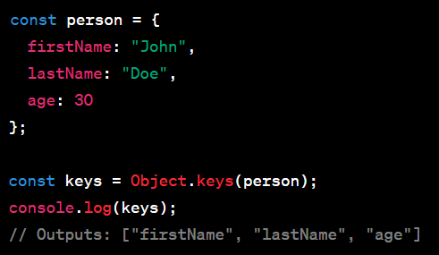

## что такое объект в js
Объект — это набор свойств, и каждое свойство состоит из имени и значения, ассоциированного с этим именем. Значением свойства может быть функция, которую можно назвать методом объекта. В дополнение к встроенным в браузер объектам, вы можете определить свои собственные объекты.

В JavaScript объект — это фундаментальный тип данных, который позволяет хранить и организовывать связанные данные и функции. Объекты используются для представления объектов, концепций или структур реального мира. Они состоят из пар ключ-значение, где каждый ключ представляет собой строку (также называемую именем свойства), а каждое значение может быть любым типом данных, включая другие объекты.

Объекты в JavaScript можно создавать с помощью двух основных методов: литералов объектов и функций-конструкторов.

### Объектные литералы :
 это самый простой способ создания объекта в JavaScript. Он предполагает заключение пар ключ-значение в фигурные скобки {}.

### Функции конструктора .
 Вы можете создавать объекты, используя функции конструктора и newключевое слово. Функции конструктора используются для создания нескольких объектов со схожими свойствами и методами.

Объекты JavaScript также можно динамически изменять, добавляя, обновляя или удаляя свойства и методы после их первоначального создания.

### Object.entries(obj)

этот метод возвращает массив пар собственных перечислимых свойств объекта [key, value]. Порядок свойств в массиве такой же, как порядок их определения в объекте.

### Object.values(obj) 

 этот метод возвращает массив значений собственных перечислимых свойств объекта.

 

### Object.keys(obj) :
  этот метод возвращает массив имен собственных перечислимых свойств объекта (ключей).

  

  Эти методы особенно полезны для перебора свойств объекта, выполнения различных операций и преобразования данных. Например, вы можете использовать эти методы в сочетании с функциями массива, такими как forEach, map, или reduceдля более простой обработки и манипулирования данными объекта.

Вот пример использования Object.keys()и forEach()для перебора свойств объекта:

  

## Что такое деструктуризация и распространение в js

Деструктуризация и распространение — мощные функции JavaScript, которые делают работу с массивами и объектами более лаконичной и гибкой.

Деструктуризация:

Деструктуризация позволяет извлекать значения из массивов или свойства объектов и более компактно присваивать их переменным. Это может упростить код, если вы хотите работать с конкретными значениями без явного доступа к индексам массива или свойствам объекта.

Деструктуризация массива :

  

Деструктуризация объекта :

  

Оператор Spread

Оператор распространения ( ...) используется для распространения элементов массива или свойств объекта в другой массив или объект. Он отлично подходит для копирования массивов или объектов и их объединения.

Распространение массива :

  

Распространение объекта :

Деструктуризацию и распространение также можно использовать вместе в различных сценариях, что позволяет удобно извлекать и объединять значения. Например:

### что это за ключевое слово 'this' в js

В JavaScript thisключевое слово — это специальный идентификатор, который относится к текущему контексту выполнения, в частности к объекту, к которому в данный момент вызывается функция или метод или с которым он связан. Значение thisопределяется тем, как вызывается функция. Это мощная концепция, которая позволяет функциям работать в разных контекстах и ​​работать с соответствующими данными.

Вот несколько ключевых моментов, которые следует понимать по этому thisключевому слову:

Глобальный контекст : в глобальной области видимости (вне любой функции) thisотносится к глобальному объекту. В веб-браузерах это обычно объект window.

Контекст функции : внутри отдельной функции значение thisзависит от того, как функция вызывается:

Если функция вызывается как обычная функция (например, myFunction()), thisссылается на глобальный объект (например, windowв браузерах).
Если функция вызывается как метод объекта (например, myObject.myMethod()), thisона ссылается на объект, содержащий метод ( myObjectв данном случае).
Стрелочные функции : Стрелочные функции ведут себя по-разному по отношению к this. Они улавливают thisзначение из окружающего их контекста (лексическая область видимости). Это означает, что значение thisвнутри стрелочной функции такое же, как и значение thisвне стрелочной функции.

Контекст метода : когда функция используется как метод объекта, она thisссылается на сам объект.

Функции конструктора : внутри функции конструктора (используемой для создания экземпляров объектов) thisссылается на вновь созданный экземпляр.

Обработчики событий . В функциях обработчиков событий, например, используемых в DOM браузера, thisобычно ссылаются на элемент, который инициировал событие.

Вот несколько примеров, иллюстрирующих эти концепции:

